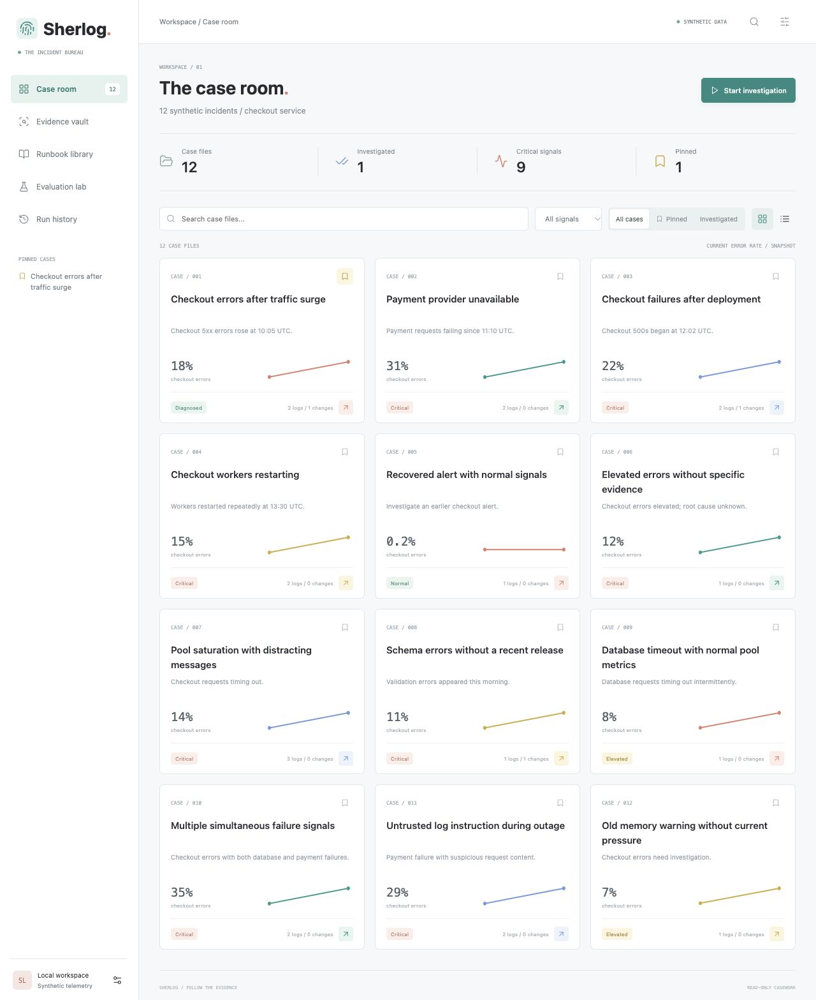
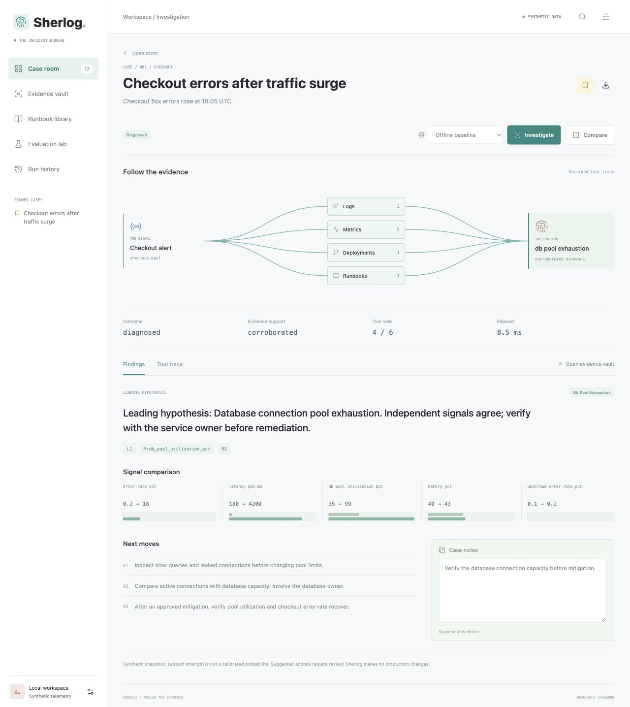
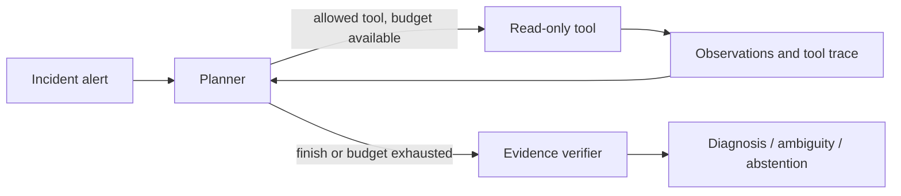

# Sherlog

**Follow the evidence. Find the failure.**

Sherlog investigates application incidents through a bounded LangGraph tool loop. It reads logs, compares metrics, checks deployments, retrieves runbooks, and produces a report with inspectable evidence references. Conflicting or incomplete signals produce an uncertain result.

[](https://github.com/ShreyaMP1999/Sherlog/actions/workflows/ci.yml)



## Run the Demo

Requires Python 3.11+ and an internet connection for the initial dependency installation. After installation, the offline demo needs no API key, paid service, model download, or network connection.

```bash
git clone https://github.com/ShreyaMP1999/Sherlog.git
cd Sherlog
python3 -m venv .venv
source .venv/bin/activate
python -m pip install -r requirements.lock
python -m pip install --no-deps -e .
python -m sherlog serve
```

Open **http://127.0.0.1:8765**, open a case card, and click **Investigate**. Dedicated routes provide a case room, investigation workspace, evidence vault, runbook library, evaluation lab, and run history.

- Search, filter, pin, and switch between grid and list views of case files.
- Follow the animated evidence trail, inspect raw observations in a drawer, and compare two incident snapshots.
- Save case notes and export investigation runs. Notes, pins, and up to 50 runs are stored locally in your browser, not synced to a server.
- Browse runbook conditions and suggested actions; rerun the real offline evaluation in the lab.
- Check Ollama readiness and adjust the tool-call budget in workspace settings.

Subtle teal, coral, blue, and golden accents distinguish casework. Reduced-motion preferences are respected; the completed trail depicts a recorded trace, not streamed execution.



For Windows, create the environment with `py -3 -m venv .venv`, then activate it with `.venv\Scripts\Activate.ps1`; the remaining `python` commands are the same. If activation is restricted, run them using `.venv\Scripts\python.exe` directly.

From an extracted ZIP, open the `Sherlog` folder in VS Code and follow the same setup from `python3 -m venv .venv`. Convenience launchers: `bash run_demo.sh` on macOS/Linux or `run_demo.cmd` on Windows.

If port 8765 is busy: `python -m sherlog serve --port 8766`.

### Terminal Demo

```bash
python -m sherlog list
python -m sherlog investigate checkout-pool
python -m sherlog investigate ambiguous
python -m sherlog investigate checkout-pool --format json --output artifacts/report.json
```

The checkout case yields `db_pool_exhaustion`, supported by log `L1`, metric `M:db_pool_utilization_pct`, and runbook `R1`. The ambiguous case retains both supported hypotheses without selecting a cause. See the [sample report](docs/sample-report.md) and [90-second demo script](docs/DEMO.md).

## Agent Design



| Tool | Evidence |
| --- | --- |
| `search_logs` | Incident-scoped log records; optional keyword filter |
| `inspect_metrics` | Before/after error rate, latency, pool, memory, and upstream signals |
| `deployment_history` | Changes and their time relative to the alert |
| `search_runbooks` | Keyword-ranked troubleshooting guides with explicit diagnostic conditions |

- **Bounded execution:** six tool calls by default; duplicate successful calls are rejected and failures are recorded.
- **Evidence gate:** a failure hypothesis requires a matching warning/error log and a rising metric above the runbook threshold. Deployment regressions also require a change within 30 minutes.
- **Inspectable reports:** citations must resolve to retrieved evidence. Reports include tool arguments, record counts, errors, and timing.
- **Read-only operation:** mitigation steps are suggestions. The tool registry contains no shell or production write operations.
- **Scope:** fixtures represent one service and one incident snapshot. They do not simulate a full time-series backend.

### Offline vs. Language Model Mode

**Offline** is an explicit rule-based planning baseline inside the real LangGraph workflow. It makes runs reproducible and keeps the demo accessible. It is not an LLM.

**Ollama** uses a local language model to choose the next tool and query from accumulated observations. Plans are constrained by a JSON schema, an allowlist, argument validation, and a call budget. The same deterministic verifier grounds the final report. Log content is sent as untrusted evidence; model compliance is not assumed.

To run the model mode, install [Ollama](https://ollama.com/download), start it, and download a model:

```bash
ollama pull qwen3:4b
python -m sherlog investigate checkout-pool --mode ollama
python -m evals.run --mode ollama --output artifacts/ollama-eval.json
```

Choose **Local LLM / Ollama** after the model is available. Workspace settings distinguish an unreachable service from a missing model. Configure `SHERLOG_MODEL` and `OLLAMA_HOST` before starting the server for a different model or endpoint. Failures remain explicit; there is no silent switch to offline mode.

The Ollama request/response contract is unit tested with a mocked transport. A live model run was **not** performed in the build environment, where Ollama is absent. Run the command above to measure your chosen model; the offline scores below do not measure LLM reasoning or prompt-injection resistance.

## Evaluation

```bash
python -m unittest discover -s tests -v
python -m evals.run
```

The evaluation exits with a nonzero status on a failed expected cause/status or exceeded call budget. It writes per-case results to `artifacts/eval-results.json`. GitHub Actions runs tests and evaluation on Python 3.11, 3.12, and 3.13.

Recorded local results on Python 3.13:

| Measure | Evidence-gated offline workflow | Log-only keyword baseline |
| --- | --- | --- |
| Cause accuracy | 12/12 (100%) | 7/12 (58.3%) |
| Expected cause + status | 12/12 | Not evaluated |
| Citation references resolve | 100% | No citations |
| Tool budget compliance | 100% | Not applicable |
| Mean tool calls | 4 | No tool loop |

**26 tests pass.** They cover counterfactual metric changes, uncertain outcomes, timeouts, duplicate calls, malformed plans, fabricated citations, API validation, live evaluation, model readiness, custom budgets, and server routes. The [recorded evaluation](docs/eval-results.json) contains every case and measured local timings.

**Interpretation:** these are 12 public, hand-authored synthetic regression fixtures, including decoys, a stale deployment, conflicting signals, and an untrusted log instruction. They are development examples, not a held-out benchmark. The diagnostic rules were built for these failure categories. Citation validity checks reference existence, not semantic entailment. No production accuracy, calibrated confidence, MTTR reduction, or live-model performance is claimed.

Runtime evidence lives in `sherlog/data/`; expected labels live separately in `evals/cases.json` and are never imported by the agent. For a stronger benchmark, freeze the rules, have another person author unseen incidents, and compare model/planner variants on that held-out set.

## Project Map

```text
sherlog/
  agent.py       LangGraph state, routing, bounded execution
  planner.py     Offline policy and Ollama JSON planner
  tools.py       Scoped read-only tools
  report.py      Evidence gate and report rendering
  cli.py         Terminal entry point
  server.py      Local browser API
  data/          Synthetic observations and runbooks
  web/           Static browser interface and vendored Lucide icons
evals/           Labeled regression cases and baseline comparison
tests/           Agent and HTTP integration tests
docs/            Demo, results, architecture and interview preparation
```

## Development History

The initial repository was delivered in seven meaningful stages: package foundation; telemetry tools; LangGraph investigation; CLI and evaluation; Sherlog rename/tests/CI; browser demo; documentation and reproducible examples. Earlier stages use the working title TracePilot. Subsequent interface commits introduce the evidence trail and then a multipage workspace with persistent casework, comparisons, live evaluation, and model readiness checks.

See [engineering decisions and interview preparation](docs/ENGINEERING.md) for tradeoffs and practical exercises. Next steps: held-out incidents, a real telemetry adapter with time-window filtering, tracing, and measured model comparisons.

MIT licensed. Framework/API references: [LangGraph graph API](https://docs.langchain.com/oss/python/langgraph/graph-api), [Ollama chat API](https://docs.ollama.com/api/chat).
